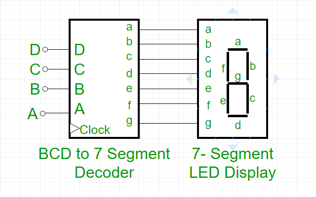
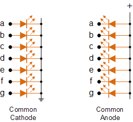
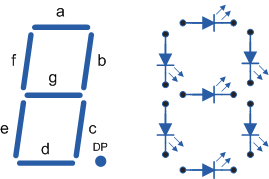

   

# TTSKY26A-BCD-TO-7SEGMENT

Tiny Tapeout project that converts 4-bit input to 7-segment display outputs for a practical HEX glyph set compatible with common 0.36" LED digital tube modules.

- Top module: tt_um_wlmoi_bcd_to_7segment
- Language: Verilog
- Clock target: 50 MHz
- Target shuttle: SKY130A

## Features

- HEX decode for 0..9, A, b, C, d, e, F
- Display enable and blank control
- Lamp test mode (all segments on)
- Decimal point path
- Output mode selection:
  - common-cathode (active-high)
  - common-anode (active-low)
- Status reporting on uio outputs

## Visual Overview

### Block Diagram



### Display Types



### Segment Layout Reference



## Interface

### Dedicated Inputs (ui[7:0])
- ui[3:0]: HEX nibble
- ui[4]: Display enable
- ui[5]: Blank
- ui[6]: Lamp test
- ui[7]: Decimal point input

### Dedicated Outputs (uo[7:0])
- uo[6:0]: Segment outputs {a,b,c,d,e,f,g}
- uo[7]: Decimal point output

### Bidirectional Input (uio[0])
- uio[0]: Active-low mode selector
  - 0: active-high segment drive (common-cathode)
  - 1: active-low segment drive (common-anode)

### Bidirectional Output Status (uio[7:4])
- uio[4]: valid digit
- uio[5]: invalid digit active
- uio[6]: display_on
- uio[7]: active_low_mode echo

## HEX Results

Segment order uses {a,b,c,d,e,f,g} with active-high convention before optional active-low inversion.

| Input | Digit | Segment bits (abcdefg) | Hex |
|-----|-------|-------------------------|-----|
| 0000 | 0 | 1111110 | 0x7E |
| 0001 | 1 | 0110000 | 0x30 |
| 0010 | 2 | 1101101 | 0x6D |
| 0011 | 3 | 1111001 | 0x79 |
| 0100 | 4 | 0110011 | 0x33 |
| 0101 | 5 | 1011011 | 0x5B |
| 0110 | 6 | 1011111 | 0x5F |
| 0111 | 7 | 1110000 | 0x70 |
| 1000 | 8 | 1111111 | 0x7F |
| 1001 | 9 | 1111011 | 0x7B |
| 1010 | A | 1110111 | 0x77 |
| 1011 | b | 0011111 | 0x1F |
| 1100 | C | 1001110 | 0x4E |
| 1101 | d | 0111101 | 0x3D |
| 1110 | e | 1001111 | 0x4F |
| 1111 | F | 1000111 | 0x47 |

## Source Files

- src/project.v
- src/bcd_to_7seg_decoder.v
- src/seg_display_control.v
- src/seg_output_mode.v

## Verification

### 1) Cocotb Regression

```powershell
cd test
make
```

### 2) Standalone Verilog Verification

```powershell
cd test
iverilog -o sim_bcd_verify.vvp -I ../src \
  ../src/project.v \
  ../src/bcd_to_7seg_decoder.v \
  ../src/seg_display_control.v \
  ../src/seg_output_mode.v \
  tb_verify.v

vvp sim_bcd_verify.vvp
```

Expected summary:
- pass=13
- fail=0

## Hardware Verification Target

To match the bought module for real-hardware verification:

- Use the 1 Digit variant of the 0.36" 7-segment display module.
- This project supports both common display types:
  - Common Cathode: set `uio[0] = 0` (active-high segment drive)
  - Common Anode: set `uio[0] = 1` (active-low segment drive)
- The listing you shared can be used as verification target as long as you select:
  - Digit count: 1 Digit
  - Type: Common Cathode or Common Anode (both are supported by this RTL)

## References

- LD3631ABU Datasheet (0.36" LED Digital Tube): https://imrnrwxhplpp5p.leadongcdn.com/LD3631ABU-aidlkBqmKonSRniilqorniq.pdf
- Shopee product page used for hardware verification target: https://shopee.co.id/product/2178321/13198892939
- GeeksforGeeks, BCD to 7 Segment Decoder: https://www.geeksforgeeks.org/digital-logic/bcd-to-7-segment-decoder/
- Electronics Tutorials, BCD to 7 Segment Decoder: https://www.electronics-tutorials.ws/combination/comb_6.html

## Creator

- William Anthony
- Electrical Engineering, Bandung Institute of Technology (ITB)
- Built in 6th semester (admitted in 2023)
- LinkedIn: https://www.linkedin.com/in/wlmoi/
- GitHub: https://github.com/wlmoi
- Instagram: https://www.instagram.com/wlmoi/

## What is Tiny Tapeout?

Tiny Tapeout is an educational project that aims to make it easier and cheaper than ever to get your digital and analog designs manufactured on a real chip.

To learn more and get started, visit https://tinytapeout.com.

## License

Apache License 2.0
